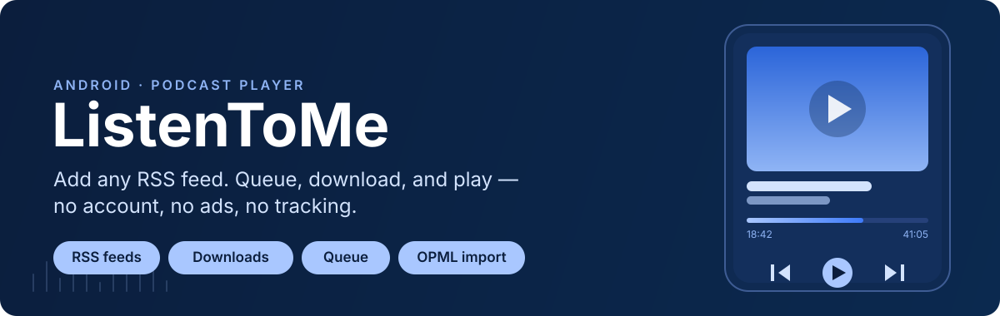

<p align="center">
  
</p>

<p align="center">
  <a href="https://developer.android.com/about/versions/oreo"></a>
  <a href="#"></a>
  <a href="#"></a>
</p>

**ListenToMe** is a native Android podcast player built with Jetpack Compose. Paste in any RSS feed and it downloads, queues, and plays your episodes — no account, no ads, no analytics, no cloud sync. Everything lives in a local Room database on your device.

## Features

- **Any RSS feed** — add a podcast by its feed URL, no directory or search service required
- **OPML import / export** — bring in your existing subscriptions or move them elsewhere
- **Downloads** — Wi-Fi-only option, a configurable storage cap, and auto-delete for played episodes
- **Queue** — reorder upcoming episodes with a drag handle
- **Playback** — background/foreground playback via Media3 with a media-session notification, configurable skip-forward/skip-back intervals, and resume-position rewind
- **Material You** — dynamic color theming on Android 12+, with a hand-tuned fallback palette on older versions

## Install

Prebuilt release APKs aren't published yet — build it yourself:

```bash
git clone https://github.com/<your-username>/android-listen-to-me.git
cd android-listen-to-me
./gradlew :app:assembleDebug
```

Install the debug build on a connected device or emulator:

```bash
adb install app/build/outputs/apk/debug/app-debug.apk
```

Requires Android 8.0 (API 26) or newer.

## Using the app

1. Open **ListenToMe** and tap **Add feed**.
2. Paste an RSS feed URL (or import an OPML file from another podcast app).
3. Open the feed to browse episodes — download one for offline listening, or add it straight to the queue.
4. Tap an episode to start playback; controls stay available from the notification and lock screen.
5. Tune skip intervals, Wi-Fi-only downloads, storage limits, and theme from **Settings**.

## How it's built

| Layer | Technology |
| --- | --- |
| UI | Jetpack Compose, Material 3, Navigation Compose |
| Playback | Media3 (ExoPlayer + MediaSessionService), running in a foreground `PlaybackService` |
| Feed parsing | OkHttp + a hand-rolled RSS/OPML parser (`network/`, `opml/`) |
| Persistence | Room (feeds, episodes, download state) |
| Images | Coil 3, with Palette for artwork-derived accent colors |
| Concurrency | Kotlin Coroutines / Flow |

The codebase is organized by feature under `app/src/main/java/com/listentome/app/`:

```text
data/         Room entities and DAOs (Feed, Episode)
network/      RSS models + parser, network-state monitoring
opml/         OPML import/export
repository/   PodcastRepository — mediates data + network + playback
playback/     PlaybackService (Media3) and PlaybackController
download/     Episode download manager
settings/     Persisted user preferences
ui/           One package per screen (feedlist, episodelist, player,
              queue, downloads, addfeed, settings) + shared components
```

## Contributing

Pull requests are welcome.

1. Fork the repo and create a branch off `main`.
2. Build and run against a device/emulator running API 26+ to sanity-check your change:
   ```bash
   ./gradlew :app:assembleDebug
   ```
3. Keep changes scoped to one feature package where possible — the `ui/` split above is the map to follow.
4. Open a PR describing what changed and why.

### Release builds

Release builds are signed using `keystore/keystore.properties`, which is not committed. To produce a signed release APK locally:

```bash
./build.sh
```

This runs `assembleRelease` and copies the output to `app/build/outputs/apk/release/listentome.apk`. Without a keystore configured, the build falls back to unsigned.

## Author

**Russell Dickenson** — [GitHub](https://github.com/russelldickenson)
- Aided by agentic coding agents Claude and Cline

## License

[GPL-3.0](https://www.gnu.org/licenses/gpl-3.0.en.html)
